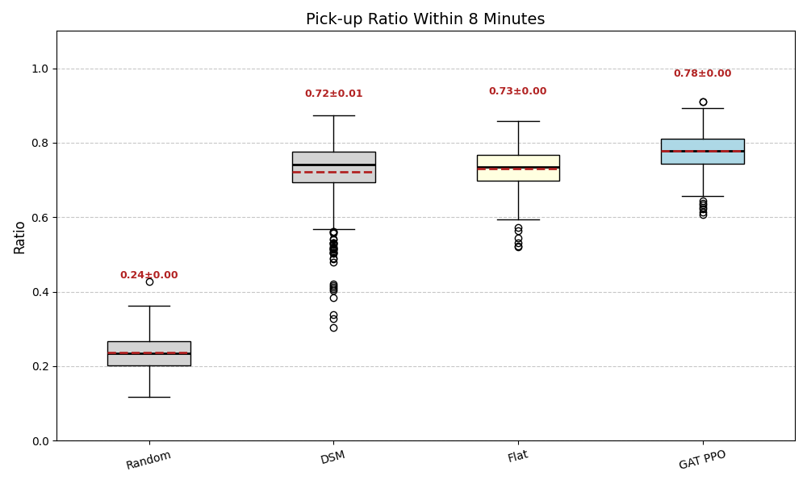
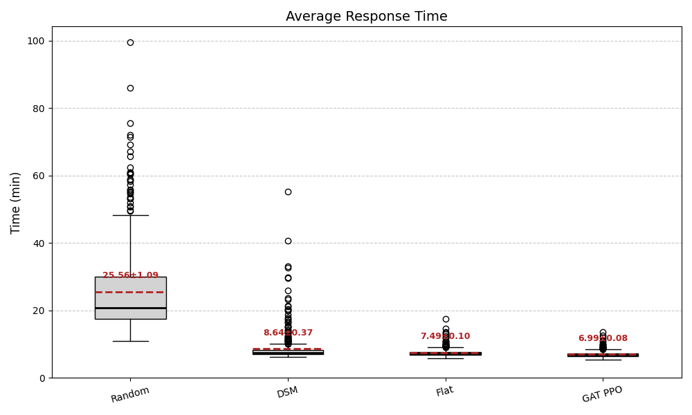
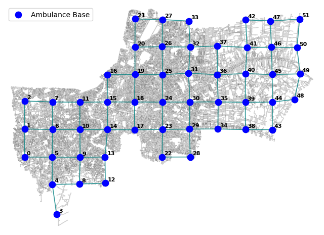
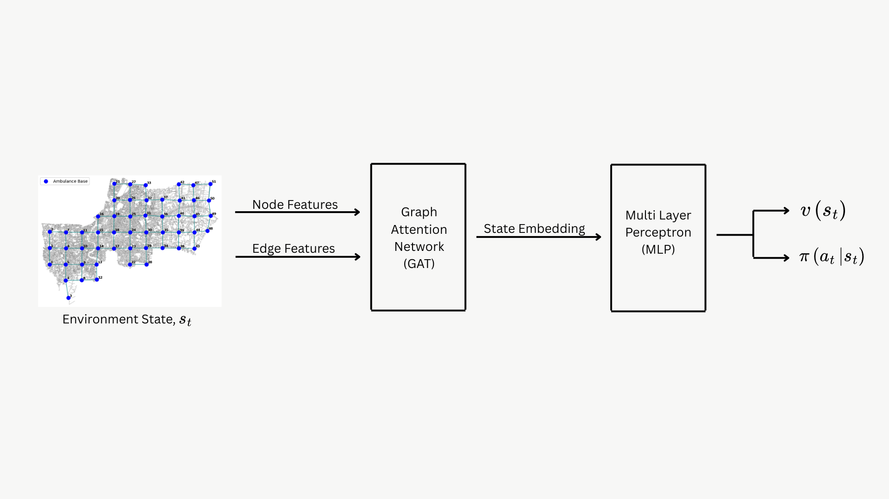
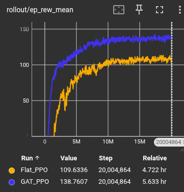

# Dynamic Ambulance Relocation via Graph Attention Network and Deep Reinforcement Learning

A Deep Reinforcement Learning system for dynamic ambulance redeployment in Bangkok, Thailand. When an ambulance becomes available after dropping a patient at a hospital, a trained PPO agent with a Graph Attention Network (GAT) recommends which base to relocate, while optimizing for future response.

## Results


| Policy | Pick-up Ratio (within 8 min) | Avg. Response Time (min) |
|---|---|---|
| Random | 0.24 ± 0.004 | 25.56 ± 1.09 |
| DSM (Double Standard Model) | 0.72 ± 0.01 | 8.64 ± 0.37 |
| Flat_PPO | 0.73 ± 0.004 | 7.49 ± 0.1 |
| **GAT_PPO (ours)** | **0.78 ± 0.004** | **6.99 ± 0.08** |
Results are averaged over 500 simulations with a 35 ambulance fleet.

DSM is classical static model with no relocation. Ambulances go back to pre-assigned base.
GAT_PPO outperforms over DSM by **8.3%** in pick-up ratio and **19%** in average response time.

Flat PPO is a standard PPO agent. Features of ambulance bases are passed directly into the PPO agent. There is no graph structure between ambulance bases.
GAT_PPO improves over flat PPO by **6.8%** in pick-up ratio and **6.7%** in average response time respectively.


## How It Works

**Simulation Environment** ([`DES_ambo.py`](DES_ambo.py))

A Discrete Event Simulation built with SimPy and wrapped in a Gymnasium interface. Each episode simulates one day (1440 min) of ambulance operations in Bangkok.

1. Incidents arrive via non-homogeneous Poisson processes.
2. Nearest available ambulance is dispatched
3. Ambulance travels to incident → nearest hospital → requests agent decision
4. Agent recommends a base to relocate to.
5. Ambulance travels there and becomes available again.

**Spatial Setup**
- Bangkok divided into **126 finer grid cells** → incident generation points


- Bangkok divided into **52 grid cells** → potential ambulance bases


- Shortest-path distances pre-computed via A\* on OpenStreetMap road network and stored as lookup tables for fast access

**Graph Construction**
- **Nodes** = 52 ambulance bases 

- **Node Features**
            1. Current ambulance count 
            2. Expected Demand of current period
            3. relocation travel time from current hospital to the base
            4. Near-future coverage (expected arrival times of up to 3 returning ambulances)

- **Edges** = immediate grid neighbors (left/right/up/down)

- A single `GATConv` layer (`in_channels=6, out_channels=64`) produces enriched per-base embeddings that are flattened and fed to the shared PPO network


## Graph Attention Network Architecture ([`GAT.py`](GAT.py))

At each state, instead of feeding a flat vector, the state is represented as a **graph of 52 ambulance bases** and processed by a Graph Attention Network (GAT) to have spatial awareness between ambulance bases. Resulted state embedding is then passed to the PPO actor-critic Networks.

This spatially-aware graph representation lets the agent learns the action *relative to neighboring bases*, rather than treating each base as an independent feature.

## Markov Decision Process 

**State**: The graph

**Action**: Which of the 52 bases the available ambulance should relocate to

**Reward**: `R = -tanh(response_time - 8)`
smooth signal centered at the 8-minute response threshold

**Initial Placement** ([`DSM_ambo.py`](DSM_ambo.py))

A Double Standard Model (linear program via PuLP) optimizes the initial number of ambulances per base to maximize double-covered demand at the start of each episode.

**Training** ([`parallel_train.py`](parallel_train.py))

PPO from Stable-Baselines3 with a custom GAT feature extractor, trained across all CPU cores in parallel.

**Hyperparameters**

| Parameter | Value |
|---|---|
| Total timesteps | 35 million |
| Feature extractor | GAT (`GATConv`, 6 → 64) |
| Policy network | Shared MLP [512, 512] |
| Learning rate | Linear decay 5e-4 → 5e-6 |
| Discount factor (γ) | 0.99 |
| GAE (λ) | 0.95 |
| Clip range (ε) | 0.2 |
| `n_steps` / `batch_size` / `n_epochs` | 1024 / 512 / 3 |

**Learning curve**




## File Structure
```
DES_ambo.py               # Gymnasium DES environment
GAT.py                    # Graph Attention Network feature extractor
DSM_ambo.py               # Double Standard Model (initial placement optimizer)
parallel_train.py         # PPO training
map_data_processing.ipynb # Spatial data preprocessing
data/
├── accident_rate.csv
├── ambulance_initialization.csv
├── distance_base_to_incident.csv
├── distance_hospital_to_base.csv
├── distance_base_to_base.csv
└── nearest_places_data.csv
```

## Dependencies
'''
simpy
gymnasium
stable-baselines3
torch
torch-geometric
numpy
pandas
pulp
matplotlib
'''

## Usage

**1. Optimize initial ambulance placement:**
```bash
python DSM_ambo.py
```

**2. Train the PPO + GAT agent:**
```bash
python parallel_train.py
```